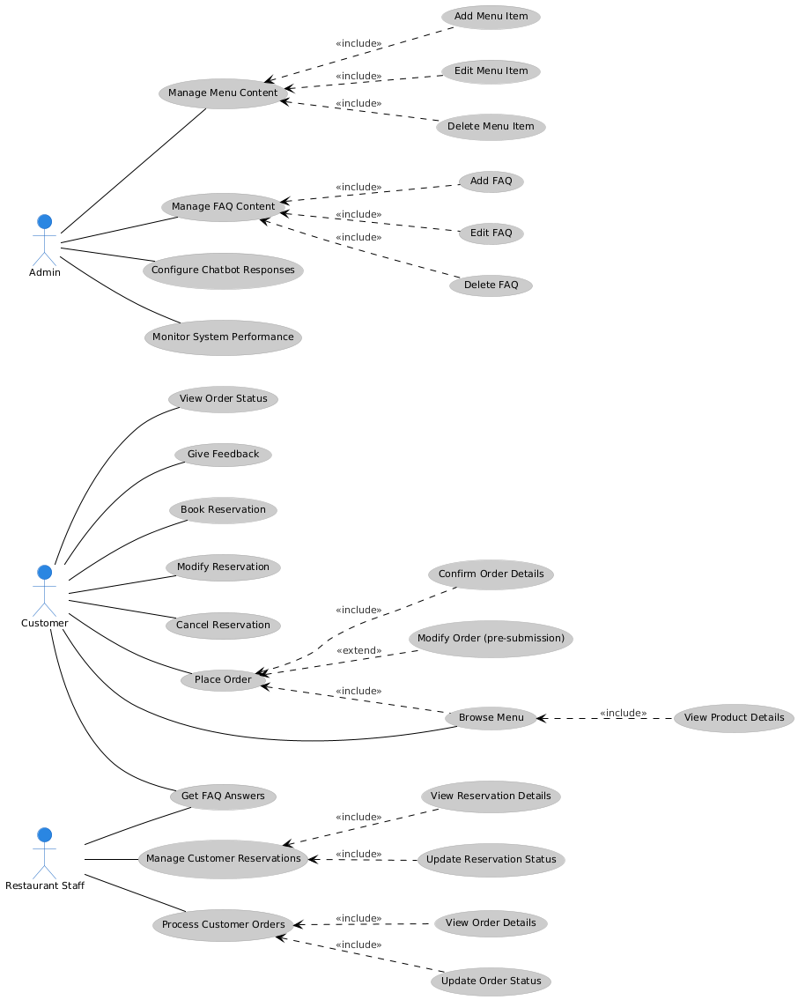
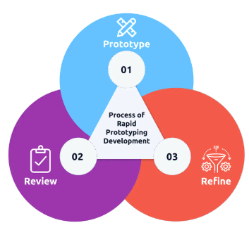
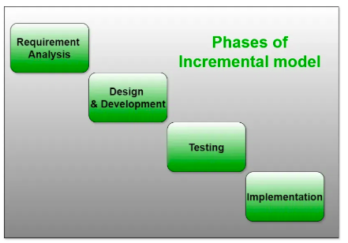
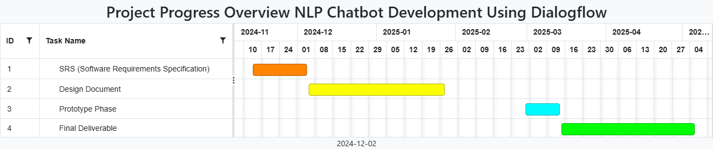

**Software Requirements Specification**

Version 1.0

  

** **

**Group Id: F24PROJECT88F2E (BC210414987)**

**Supervisor Name: Abdullah Qamar**

**Revision History**

  ---------------- ------------- ------------------------- ----------------------
  **Date           **Version**   **Description**           **Author**
  (dd/mm/yyyy)**                                           

  28/11/2024       1.0           The first version of the  BC210414987
                                 Software Requirements     
                                 Specification (SRS)       
                                 document for the          
                                 restaurant chatbot        
                                 outlines its purpose and  
                                 scope. The chatbot is     
                                 designed to manage tasks  
                                 like table reservations,  
                                 order-taking, and         
                                 customer support, with    
                                 key features such as menu 
                                 browsing, reservations,   
                                 and order management,     
                                 while excluding advanced  
                                 functionalities like      
                                 payment integration and   
                                 voice recognition. It     
                                 details functional        
                                 requirements for user     
                                 interactions and          
                                 non-functional            
                                 requirements focusing on  
                                 performance, scalability, 
                                 and ease of use. A use    
                                 case diagram highlights   
                                 customer and staff        
                                 interactions with the     
                                 chatbot, supported by     
                                 detailed usage scenarios. 
                                 The project follows a     
                                 hybrid approach,          
                                 combining the Incremental 
                                 Model for gradual feature 
                                 additions and the Rapid   
                                 Prototyping Model for     
                                 quick development and     
                                 early user feedback,      
                                 ensuring continuous       
                                 refinement. A Gantt chart 
                                 outlines the timeline and 
                                 milestones for efficient  
                                 progress tracking. This   
                                 document guides           
                                 development and will be   
                                 updated as needed.        

                                                           

                                                           

                                                           
  ---------------- ------------- ------------------------- ----------------------

**[Table of Contents]{.underline}**

1.  [Scope of the project](#scope)

2.  [Functional Requirements Non Functional requirements](#FRNFR)

3.  [Use Case Diagram](#UCD)

4.  [Usage Scenarios](#UCS)

5.  [Adopted Methodology](#Adopted)

6.  [Work Plan (Use MS Project to create Schedule/Work Plan)](#Gantt)

> **[SRS Document]{.underline}**

[]{#scope .anchor}**[Scope of Project:]{.underline}**

This project focuses on developing an AI-powered chatbot for the
restaurant industry, designed to improve customer service and streamline
restaurant operations. The chatbot will use Google Dialogflow, a
powerful natural language processing (NLP) tool, to understand and
respond to user inquiries in a conversational way. The primary aim is to
automate essential tasks such as table reservations, order placements,
and answering frequently asked questions (FAQs), enhancing customer
satisfaction and reducing the workload for restaurant staff. The backend
system will be built using Python, while the frontend will be developed
using HTML, CSS, and JavaScript, ensuring a seamless and user-friendly
interface.

The key functionalities of the chatbot include helping customers book,
modify, or cancel table reservations, browse the menu, and place orders.
It will also provide information about the restaurant, such as operating
hours, special offers, and other common queries. The chatbot will be
accessible through a simple interface, allowing customers to interact
effortlessly and have their questions answered in real-time. The
database, powered by MySQL, will store reservation details, customer
orders, and FAQs, ensuring smooth operation and quick access to
essential data.

However, the initial version of the chatbot will not include some
advanced features. For example, payment processing, voice recognition,
and integration with third-party delivery platforms will not be part of
the first release. Additionally, multilingual support and personalized
recommendations will not be available in this phase, although they may
be considered for future updates. The primary focus of this project is
to deliver a functional and efficient chatbot that meets the immediate
needs of customers and restaurant staff, while laying the groundwork for
potential enhancements down the line.

[]{#FRNFR .anchor}

**[Functional Requirements]{.underline}**

1.  **[Table Reservations]{.underline}**

> **Requirement:** The chatbot must allow customers to book, modify, and
> cancel table reservations.\
> **Action to Fulfill:** The chatbot will enable users to interact with
> it by selecting a date, time, and the number of people for their
> reservation. It will confirm the details, store the reservation in the
> system, and send reminders or updates if needed.

2.  **[Menu Browsing]{.underline}**

> **Requirement:** The chatbot should display the restaurant\'s menu and
> allow customers to browse available dishes.\
> **Action to Fulfill:** The chatbot will retrieve the menu items from
> the database and present them to customers. Users will be able to
> search, filter by categories (e.g., appetizers, main courses), and
> check item availability.

3.  **[Order Placement]{.underline}**

> **Requirement:** The chatbot should allow customers to place orders
> directly from the menu.\
> **Action to Fulfill:** After browsing the menu, customers can add
> items to their cart. The chatbot will summarize the order for
> confirmation before finalizing and storing it in the system.

4.  **[FAQs]{.underline}**

> **Requirement:** The chatbot should provide answers to frequently
> asked questions regarding services, operating hours, special offers,
> etc.\
> **Action to Fulfill:** Users will ask common questions, and the
> chatbot will retrieve predefined responses from its database to
> address those inquiries.

5.  **[Order Confirmation and Modifications]{.underline}**

> **Requirement:** The chatbot should confirm orders and allow customers
> to modify them before submission.\
> **Action to Fulfill:** After selecting items, the chatbot will display
> a summary for review. Customers can confirm or modify their selections
> before submitting the final order.

**[Non-Functional Requirements]{.underline}**

1.  []{#UCD .anchor}**[Performance]{.underline}**

> **Requirement:** The chatbot should respond to user queries within 3
> seconds.\
> **Action to Fulfill:** The backend (Python) will be optimized for
> speed and efficiency, using caching and query optimization techniques
> to minimize response times.

2.  **[Usability]{.underline}**

> **Requirement:** The chatbot interface should be simple and intuitive,
> ensuring ease of use for all customers.\
> **Action to Fulfill:** The frontend (HTML/CSS/JS) will follow UX best
> practices, ensuring clear instructions and an intuitive design.
> Usability testing will be performed to verify customer satisfaction.

3.  **[Scalability]{.underline}**

> **Requirement:** The system should handle a growing number of users as
> the restaurant expands.\
> **Action to Fulfill:** The system architecture will be designed to
> scale, utilizing cloud platforms to accommodate traffic spikes. Load
> testing will identify scalability challenges.

4.  **[Security]{.underline}**

> **Requirement:** The system must ensure the security of customer data
> and sensitive information.\
> **Action to Fulfill:** Data encryption (e.g., SSL/TLS) will secure
> communication, and authentication protocols will protect sensitive
> information such as user orders and account details.

5.  **[Availability]{.underline}**

> **Requirement:** The chatbot must be available 24/7 with minimal
> downtime.\
> **Action to Fulfill:** The system will be hosted on a reliable
> platform with high availability. Monitoring tools will ensure that any
> issues are detected and resolved quickly.

6.  **[Maintainability]{.underline}**

> **Requirement:** The chatbot system architecture and code should be
> easy to maintain and update.\
> **Action to Fulfill:** The code will be modular and well-documented.
> Version control tools (e.g., Git) will be used for easy updates. An
> admin interface will allow restaurant staff to modify chatbot
> responses and update the menu.

7.  **[Reliability]{.underline}**

> **Requirement:** The chatbot must function reliably without errors or
> crashes.\
> **Action to Fulfill:** Thorough testing (unit, integration, and user
> testing) will be conducted to identify and resolve bugs. Error
> handling and logging will be implemented to ensure smooth functioning.

8.  **[Compatibility]{.underline}**

> **Requirement:** The chatbot should work seamlessly across different
> devices and platforms.\
> **Action to Fulfill:** The chatbot frontend will be responsive,
> ensuring compatibility across various screen sizes and devices.
> Cross-browser compatibility testing will ensure consistent performance
> across major web browsers (e.g., Chrome, Firefox, Safari).

**Use Case Diagram**[]{#UCS .anchor}

**[Usage Scenarios:]{.underline}**

### **[Use Case Scenario for Customers]{.underline}** {#use-case-scenario-for-customers .unnumbered}

#### **1. Make Reservation** {#make-reservation .unnumbered}

  ------------------------------------------------------------------------------
  **Heading**           **Description**
  --------------------- --------------------------------------------------------
  **Use Case Title**    Make Reservation

  **Use Case ID**       UC-001

  **Actions**           1\. User interacts with the chatbot.\
                        2. Provides details like date, time, and guests.\
                        3. Chatbot confirms the reservation.

  **Description**       Allows customers to reserve a table by providing
                        reservation details.

  **Alternative Paths** 1\. If reservation details are incomplete, chatbot asks
                        for missing information.\
                        2. If the requested time slot is unavailable, the
                        chatbot offers alternatives.

  **Pre-Conditions**    User is logged into the system and interacts with the
                        chatbot.

  **Post-Conditions**   The reservation is confirmed, and a notification is sent
                        to the restaurant.

  **Author**            BC 210414987

  **Exceptions**        Chatbot fails to confirm reservation due to
                        unavailability of the time slot.
  ------------------------------------------------------------------------------

#### **2. Modify Reservation** {#modify-reservation .unnumbered}

  ------------------------------------------------------------------------------
  **Heading**           **Description**
  --------------------- --------------------------------------------------------
  **Use Case Title**    Modify Reservation

  **Use Case ID**       UC-002

  **Actions**           1\. User requests to modify reservation.\
                        2. User provides the updated details.\
                        3. Chatbot confirms the modification.

  **Description**       Allows customers to change the reservation details, such
                        as time or guest count.

  **Alternative Paths** 1\. User cancels the modification.\
                        2. Chatbot asks for clarification if details are
                        incomplete.

  **Pre-Conditions**    A reservation has been made, and the user wants to
                        modify it.

  **Post-Conditions**   The modified reservation details are saved and
                        confirmed.

  **Author**            BC 210414987

  **Exceptions**        Modification fails due to unavailability of new time
                        slot.
  ------------------------------------------------------------------------------

####  {#section .unnumbered}

#### **3. Cancel Reservation** {#cancel-reservation .unnumbered}

  ---------------------------------------------------------------------------
  **Heading**           **Description**
  --------------------- -----------------------------------------------------
  **Use Case Title**    Cancel Reservation

  **Use Case ID**       UC-003

  **Actions**           1\. User requests to cancel the reservation.\
                        2. Chatbot processes the cancellation.\
                        3. Confirmation of cancellation is sent.

  **Description**       Enables users to cancel previously made reservations.

  **Alternative Paths** 1\. User decides not to cancel.\
                        2. Confirmation of cancellation is delayed.

  **Pre-Conditions**    A reservation is already made.

  **Post-Conditions**   The reservation is canceled, and the restaurant is
                        notified.

  **Author**            BC 210414987

  **Exceptions**        Chatbot fails to cancel due to technical errors.
  ---------------------------------------------------------------------------

#### **4. Browse Menu** {#browse-menu .unnumbered}

  ------------------------------------------------------------------------------
  **Heading**           **Description**
  --------------------- --------------------------------------------------------
  **Use Case Title**    Browse Menu

  **Use Case ID**       UC-004

  **Actions**           1\. User requests to browse the menu.\
                        2. Chatbot provides the menu or specific categories.\
                        3. User selects items to view.

  **Description**       Provides the customer with an option to explore the menu
                        items, filtered by categories.

  **Alternative Paths** 1\. User asks for a specific item.\
                        2. User browses by categories like vegan, gluten-free.

  **Pre-Conditions**    Menu items are preloaded in the system.

  **Post-Conditions**   User views menu details or receives item suggestions.

  **Author**            BC 210414987

  **Exceptions**        Menu fails to load due to system errors.
  ------------------------------------------------------------------------------

####  {#section-1 .unnumbered}

####  {#section-2 .unnumbered}

#### **5. Place Order** {#place-order .unnumbered}

  ----------------------------------------------------------------------------
  **Heading**           **Description**
  --------------------- ------------------------------------------------------
  **Use Case Title**    Place Order

  **Use Case ID**       UC-005

  **Actions**           1\. User selects items from the menu.\
                        2. User confirms the order.\
                        3. Chatbot processes the order.

  **Description**       Enables customers to place their food orders through
                        the chatbot.

  **Alternative Paths** 1\. User modifies the order before confirming.\
                        2. User cancels the order.\
                        3. Order fails due to an unavailable item.

  **Pre-Conditions**    Menu is displayed and available for browsing.

  **Post-Conditions**   The order is placed, and the user receives a
                        confirmation message.

  **Author**            BC 210414987

  **Exceptions**        Order cannot be placed due to an item being out of
                        stock.
  ----------------------------------------------------------------------------

#### **View Order Summary**

  ---------------------------------------------------------------------------
  **Heading**           **Description**
  --------------------- -----------------------------------------------------
  **Use Case Title**    View Order Summary

  **Use Case ID**       UC-006

  **Actions**           1\. User requests the order summary.\
                        2. Chatbot retrieves order details.\
                        3. User views the summary.

  **Description**       Allows customers to view a summary of their placed
                        orders.

  **Alternative Paths** 1\. User requests to modify or cancel the order.\
                        2. User views previous orders.

  **Pre-Conditions**    An order has been placed, and user requests a
                        summary.

  **Post-Conditions**   The user is shown the order summary.

  **Author**            BC 210414987

  **Exceptions**        Chatbot fails to retrieve order details.
  ---------------------------------------------------------------------------

####  {#section-3 .unnumbered}

#### **Ask FAQs**

  ------------------------------------------------------------------------------
  **Heading**           **Description**
  --------------------- --------------------------------------------------------
  **Use Case Title**    Ask FAQs

  **Use Case ID**       UC-007

  **Actions**           1\. User asks a question.\
                        2. Chatbot provides a predefined response.\
                        3. User receives the answer.

  **Description**       Answers frequently asked questions (FAQs) for users
                        about restaurant services or policies.

  **Alternative Paths** 1\. User asks follow-up questions.\
                        2. User is redirected to a human representative.

  **Pre-Conditions**    FAQ data is available, and the chatbot is functioning.

  **Post-Conditions**   User receives an answer or is redirected for further
                        assistance.

  **Author**            BC 210414987

  **Exceptions**        Chatbot cannot find a response to the user\'s query.
  ------------------------------------------------------------------------------

###  {#section-4 .unnumbered}

### **[Use Case Scenario for Restaurant Staff]{.underline}** {#use-case-scenario-for-restaurant-staff .unnumbered}

#### **Update Menu**

  -------------------------------------------------------------------------------
  **Heading**           **Description**
  --------------------- ---------------------------------------------------------
  **Use Case Title**    Update Menu

  **Use Case ID**       UC-008

  **Actions**           1\. Restaurant staff logs in.\
                        2. Adds, edits, or removes items from the menu.\
                        3. Saves updated menu.

  **Description**       Allows staff to update the menu by adding new items,
                        modifying existing ones, or removing outdated ones.

  **Alternative Paths** 1\. Staff cancels the update.\
                        2. Item details are incomplete, prompting additional
                        inputs.

  **Pre-Conditions**    Staff is logged in with permission to update the menu.

  **Post-Conditions**   The menu is updated, and changes are reflected in the
                        chatbot.

  **Author**            BC 210414987

  **Exceptions**        Staff is unable to update the menu due to system errors.
  -------------------------------------------------------------------------------

#### **View Reservations**

  -------------------------------------------------------------------------
  **Heading**           **Description**
  --------------------- ---------------------------------------------------
  **Use Case Title**    View Reservations

  **Use Case ID**       UC-009

  **Actions**           1\. Staff queries reservation list.\
                        2. Chatbot displays the reservation details.

  **Description**       Displays all the reservations made by customers.

  **Alternative Paths** 1\. Staff filters reservations by date or time.\
                        2. Reservation details are incomplete.

  **Pre-Conditions**    Staff is logged in and has access to reservations.

  **Post-Conditions**   The staff can view and manage reservations.

  **Author**            BC 210414987

  **Exceptions**        Unable to retrieve reservations due to system
                        errors.
  -------------------------------------------------------------------------

####  {#section-5 .unnumbered}

####  {#section-6 .unnumbered}

#### **Process Orders**

  -----------------------------------------------------------------------------
  **Heading**           **Description**
  --------------------- -------------------------------------------------------
  **Use Case Title**    Process Orders

  **Use Case ID**       UC-010

  **Actions**           1\. Staff views pending orders.\
                        2. Processes the orders and updates the status.

  **Description**       Allows restaurant staff to view and process customer
                        orders.

  **Alternative Paths** 1\. Staff requests more information.\
                        2. Order is pending due to payment confirmation.

  **Pre-Conditions**    Orders are placed, and staff is logged in with access
                        to order details.

  **Post-Conditions**   The order is processed, and the customer is notified.

  **Author**            BC 210414987

  **Exceptions**        Order processing fails due to technical errors.
  -----------------------------------------------------------------------------

###  {#section-7 .unnumbered}

###  {#section-8 .unnumbered}

### **[Use Case Scenario for Admin]{.underline}** {#use-case-scenario-for-admin .unnumbered}

#### **Manage Chatbot Settings**

  -----------------------------------------------------------------------------
  **Heading**           **Description**
  --------------------- -------------------------------------------------------
  **Use Case Title**    Manage Chatbot Settings

  **Use Case ID**       UC-011

  **Actions**           1\. Admin logs in.\
                        2. Updates chatbot settings, such as response templates
                        or behavior.

  **Description**       Admin can manage chatbot settings to optimize user
                        interactions.

  **Alternative Paths** 1\. Admin reverts to default settings.\
                        2. Changes are canceled by admin.

  **Pre-Conditions**    Admin is logged in with appropriate permissions.

  **Post-Conditions**   Chatbot settings are updated.

  **Author**            BC 210414987

  **Exceptions**        Admin cannot modify settings due to permission issues.
  -----------------------------------------------------------------------------

#### **Monitor User Interactions**

  ------------------------------------------------------------------------------
  **Heading**           **Description**
  --------------------- --------------------------------------------------------
  **Use Case Title**    Monitor User Interactions

  **Use Case ID**       UC-012

  **Actions**           1\. Admin reviews user interactions.\
                        2. Admin analyzes behavior data and feedback.

  **Description**       Allows the admin to track how users interact with the
                        chatbot for performance improvement.

  **Alternative Paths** 1\. Admin receives detailed reports.\
                        2. Admin adjusts chatbot settings based on feedback.

  **Pre-Conditions**    Admin has access to interaction data.

  **Post-Conditions**   The admin can assess and adjust chatbot performance.

  **Author**            BC 210414987

  **Exceptions**        Admin cannot retrieve interaction data due to system
                        errors.
  ------------------------------------------------------------------------------

####  {#section-9 .unnumbered}

#### **Log Issues**

  -----------------------------------------------------------------------------
  **Heading**           **Description**
  --------------------- -------------------------------------------------------
  **Use Case Title**    Log Issues

  **Use Case ID**       UC-013

  **Actions**           1\. Admin logs issues related to the chatbot.\
                        2. Admin records the issue and its status.

  **Description**       Admin can log any issues or bugs encountered during
                        chatbot interactions.

  **Alternative Paths** 1\. Admin resolves the issue.\
                        2. Issue is assigned to technical support.

  **Pre-Conditions**    Admin has logged in and identified an issue.

  **Post-Conditions**   The issue is logged for tracking and resolution.

  **Author**            BC 210414987

  **Exceptions**        Admin fails to log the issue due to technical issues.
  -----------------------------------------------------------------------------

[]{#Adopted .anchor}

**[Adopted Methodology]{.underline}**

**[Adopted Methodology for NLP Chatbot Development using
Dialogflow]{.underline}**

For the development of the NLP Chatbot using Dialogflow, I have chosen a
hybrid methodology that combines two well-known software development
models: Rapid Prototyping and Incremental Model. This combination
ensures quick development, early user feedback, and flexibility in
making improvements as the project progresses. Here's a detailed
explanation of the adopted methodology and how it applies to the chatbot
development project:

**[1. Rapid Prototyping Model]{.underline}**

The Rapid Prototyping Model is used for quickly developing a functional
version of the chatbot, often referred to as a \"prototype.\" This model
focuses on getting a basic version of the product up and running,
followed by gathering user feedback to make continuous improvements.

**Steps in Rapid Prototyping Model:**

**Initial Prototype Development:** The first step is to create a simple
version of the chatbot using Dialogflow. The initial prototype will be
limited in functionality, with just the basic interactions, such as
answering frequently asked questions (FAQs) and providing basic
information (like the restaurant\'s hours or menu items).

**User Feedback:** Once the prototype is built, it is presented to users
(restaurant staff, customers, or testers) for feedback. This stage is
crucial, as it helps identify gaps, errors, and opportunities for
improvement in the chatbot behavior and interactions.

**Refinement:** Based on the feedback, adjustments are made to the
prototype. This could include fixing any issues that users encountered
or improving the chatbot understanding of user inputs. The refinement
phase also adds new features based on feedback, such as supporting
reservations or order-taking functionality.

**Iterate and Repeat:** This process of prototyping, feedback, and
refinement continues in multiple iterations. With each iteration, the
chatbot becomes more sophisticated and better aligned with the users\'
needs.

**Reason for Selecting Rapid Prototyping**

**Quick Development and Testing:** By quickly building a prototype, I
can test the chatbot with real users early in the development process.
This saves time in the long run by identifying issues early on.

**User-Centric Approach:** Continuous user feedback ensures that the
chatbot evolves in a way that directly addresses user needs, making it
more useful and effective in real-world interactions.

**Flexibility for Changes:** Given that the nature of user interactions
with chatbot can be unpredictable, the rapid prototyping approach allows
for flexibility in adjusting the chatbot capabilities and features based
on user behavior and feedback.

**[2. Incremental Model]{.underline}**

The Incremental Model is applied after the prototype is developed. In
this model, the chatbot is built in small, manageable parts
(increments), with each increment adding new features and functionality
to the existing system.

**Steps in Incremental Model:**

**Start with Core Features:** The first increment involves developing
the core functionality of the chatbot, which might include basic
responses to FAQs and general information. The chatbot should be able to
engage in simple conversations, such as greeting users and answering
basic queries about the restaurant.

**Add More Features Incrementally:** After the initial core
functionality is working, additional features are added one at a time.
For example, the next increment could include adding the ability to
handle reservations, while a subsequent increment could focus on
order-taking or handling customer support queries.

**Testing Each Increment:** Each increment is tested before moving on to
the next. After each feature is added, user feedback is gathered to
ensure that it works as expected and does not introduce new issues.

**Refinement and Enhancement:** Based on testing and feedback, the
chatbot is continuously refined. For instance, if users have trouble
with a specific type of query, the corresponding part of the chatbot can
be enhanced to provide better responses.

**Reason for Selecting** **Incremental Model**

**Manageable Development Process:** The chatbot is developed in smaller,
manageable stages, making it easier to focus on one specific
functionality at a time. This helps reduce the complexity of the project
and ensures that each part works as expected before adding more
features.

**Easier Testing and Debugging:** Since each new feature is added
incrementally, it's easier to identify and fix bugs. If an issue arises
after adding a feature, it's simpler to pinpoint which increment caused
the problem.

**Scalability and Flexibility:** This model allows for the chatbot to be
built and improved over time, without requiring a complete rewrite. Each
new feature can be integrated into the existing system, allowing for
flexibility in responding to changing requirements or user feedback.

**3. Combining Rapid Prototyping and Incremental Model**

The combination of Rapid Prototyping and the Incremental Model offers a
balanced approach to developing the NLP chatbot:

**Rapid Development and Continuous Feedback:** The rapid prototyping
model ensures that a basic version of the chatbot is developed quickly,
allowing for early testing and user feedback. This helps in quickly
identifying and fixing problems early in the development cycle.

**Gradual Expansion and Improvement:** The incremental model takes over
after the prototype is built. New features and improvements are added
one by one, ensuring that the chatbot evolves in a structured and
manageable way.

**User-Centric Development:** Both models prioritize user feedback. In
the rapid prototyping phase, users get a chance to interact with an
early version of the chatbot and provide valuable input. In the
incremental phase, each new feature is tested by users to ensure it
meets their needs.

**Adaptability to Changes:** The combination of both models provides a
flexible development approach that can quickly adapt to changes in user
requirements or business needs. Whether it's adding a new feature or
refining an existing one, the chatbot can evolve in response to
real-world challenges.

[]{#Gantt .anchor}

**[Work Plan (Use MS Project to create Schedule/Work
Plan)]{.underline}**

